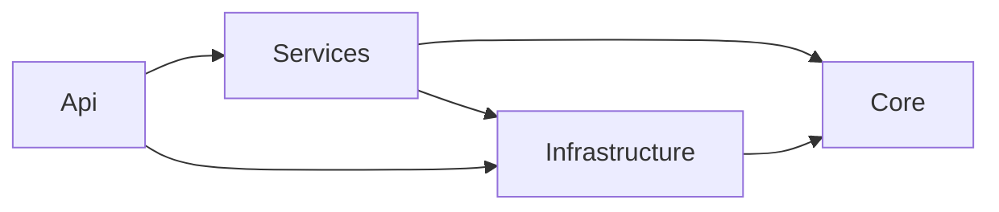

# Agent instructions — .NET solution (`StoryApp/`)

This file covers the **backend solution only**. For the full repo (React + .NET) and how they integrate, see **`AGENTS.md`** in the **parent directory** (monorepo root).

Use this file together with **nested `AGENTS.md`** files under each project: prefer the **most specific** instructions for the code you are editing.

---

## What this solution is

- **.NET 9** backend for collaborative stories and real-time turns.
- **PostgreSQL** + **EF Core** for persistence.
- **JWT** for HTTP APIs and **SignalR**.
- **Clean Architecture** with one pragmatic twist: **`StoryApp.Services` references `StoryApp.Infrastructure`** so application services can use repository implementations via their **Core** interfaces (no extra abstraction project).

---

## Commands

| Action | Command |
|--------|---------|
| Build | `dotnet build` |
| Restore | `dotnet restore` |
| Run API (also runs pending EF migrations) | `dotnet run --project StoryApp.Api` |
| Add EF migration | `dotnet ef migrations add <MigrationName> --project StoryApp.Infrastructure --startup-project StoryApp.Api` |
| Apply migrations to DB | `dotnet ef database update --project StoryApp.Infrastructure --startup-project StoryApp.Api` |

There are **no test projects** in the solution yet.

---

## Project map

| Project | Responsibility |
|---------|----------------|
| **StoryApp.Core** | Domain: **entities**, **DTOs** (requests/responses and API/SignalR payloads), **repository and service interfaces**, **domain exceptions**, **query builders** (fluent `IQueryable` composition), **small extensions** (`QueryableExtensions`, `ObjectExtensions`). Only NuGet dep of note: **EF Core** (for query types and `Include` helpers)—**no ASP.NET**. |
| **StoryApp.Infrastructure** | **StoryDbContext**, EF entity configuration, **migrations**, **repository implementations**, **seeding**. |
| **StoryApp.Services** | **AuthService**, **UserService**, **StoryService**—business rules, JWT/refresh handling (auth), mapping entities → DTOs via `FromEntity` / helpers. |
| **StoryApp.Api** | **Controllers**, **SignalR `StoryHub`**, **JWT + Swagger + CORS**, **global exception middleware**, **DI composition** (`Program.cs`). |

### Dependency direction

---

## Where to put new code

- **New entity or table** → `StoryApp.Core` entity + `StoryApp.Infrastructure` configuration + migration.
- **New REST contract** → DTOs/requests in **Core**, controller in **Api**, logic in **Services** (or **Hub** if real-time only).
- **New query shape** → extend the relevant **query builder** in Core and the **repository** in Infrastructure.
- **Cross-cutting HTTP errors** → throw **Core** exceptions (`NotFoundException`, etc.); **Api** middleware maps them to status codes.

---

## Runtime and configuration (high level)

- **Connection string**: `DefaultConnection` (PostgreSQL) in API configuration.
- **Migrations**: applied on API startup via `Database.Migrate()` in `Program.cs`.
- **SignalR**: hub mapped at **`/storyHub`**; JWT is passed as query parameter **`access_token`** (see JWT bearer events in `Program.cs`).
- **CORS**: policy **`AllowReactApp`** for the React dev server (`localhost:3000` etc.).
- **Redis** SignalR backplane: registration is **commented out** in `Program.cs` (reserved for later).

---

## Contracts vs implementations (important)

These interfaces exist in **StoryApp.Core** but have **no implementation or DI registration** in **StoryApp.Services** / **`Program.cs`** today:

- **`ITurnService`** — turn use cases are expressed as a service contract, but **real-time turns are implemented inside `StoryHub`** using **`ITurnRepository`** (and related repos) directly.
- **`IPresenceService`** — contract for presence/typing; **hub and `UserService.UpdateUserPresenceAsync`** cover related behavior without a dedicated presence service class yet.

When adding features, either **implement and register** these services and refactor callers, or **keep the current pattern** (hub + repos) and update/remove stale contracts—stay consistent with the rest of the codebase.

---

## Nested agent docs

| Path | Focus |
|------|--------|
| `StoryApp.Core/AGENTS.md` | Entities, DTOs, interfaces, exceptions, query builders |
| `StoryApp.Infrastructure/AGENTS.md` | DbContext, repositories, migrations, seeding |
| `StoryApp.Services/AGENTS.md` | Application services, patterns, DI |
| `StoryApp.Api/AGENTS.md` | Controllers, hub, middleware, pipeline |

---

## Related docs

- **`CLAUDE.md`** — similar commands and architecture summary for Claude Code.
